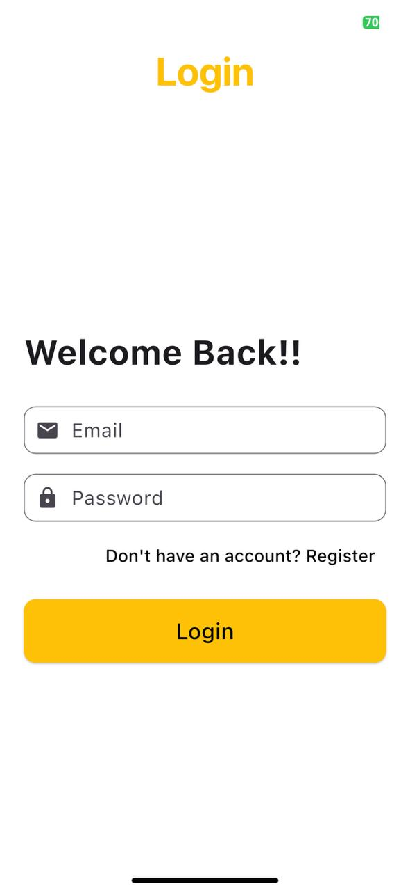

 # Task Management App
### The Task Management App is a Flutter-based mobile application designed to help users efficiently manage their tasks. It provides features for creating, updating, and organizing tasks with ease. The app supports multiple task categories and allows for seamless interaction through a clean, intuitive UI.

## Key Features:
- Task creation, editing, and deletion
- Task categorization and prioritization
- User-friendly and responsive interface

## Architecture:
This app follows the MVVM (Model-View-ViewModel) architecture, ensuring separation of concerns and maintainable code. The app leverages **Riverpod** for state management and uses various Flutter packages for efficient task management.

## Packages Used:
- `firebase_core` for Firebase initialization
- `hooks_riverpod` for state management
- `cloud_firestore` for storing tasks in the cloud
- `firebase_auth` for user authentication
- `freezed_annotation` for data class generation
- `json_annotation` for JSON serialization
- `shared_preferences` for storing local user data
- `top_snackbar_flutter` for displaying snackbars
- `go_router` for route management
- `auto_route_generator` for code generation of routesoud

### Screenshots

  
  
  

  
  

